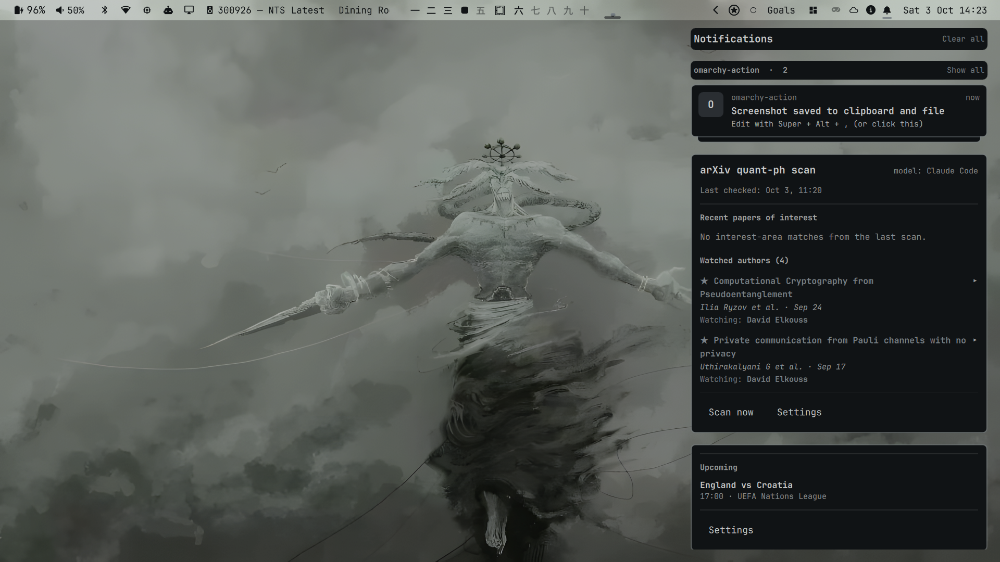

# Omahub



A slide-out hub for your Omarchy bar. One bell in the bar opens a right-hand panel with a longer, stacked history of your OS notifications and, beneath them, floating cards that other plugins contribute from their own popups. It is built for notifications today and for any plugin popup you want to keep one click away.

**Design note: this plugin extends the manifest convention.** Omarchy has no concept of one plugin hosting another's UI, so the hub introduces an optional top-level `hubCard` key in a plugin's `manifest.json` (`{"entry": "Card.qml", "title": "…", "contract": 1}`). It is deliberately *not* a new `kinds` value or an `entryPoints` entry: the shell's loader and the marketplace validator both ignore unknown top-level keys but reject unknown `kinds`, so a separate key keeps every plugin that carries it valid and installable without the hub. The hub scans `~/.config/omarchy/plugins/*/manifest.json`, loads each declared `Card.qml` by file path (the same trust level as the bar loading a plugin's `BarWidget.qml`), and lets you pick and order the cards in its settings. To keep a plugin's bar popup and its hub card from drifting apart, the recommended structure splits the plugin into a non-visual `Backend.qml` and a themeable `View.qml` that both surfaces share; a plugin that adopts this behaves exactly as before when the hub is absent. **[MIGRATING.md](MIGRATING.md) is a step-by-step guide to converting an existing plugin**, and [`template/`](template/) is a complete minimal example. The key name is not standardised anywhere, so treat it as this plugin's convention; see the [roadmap](ROADMAP.md) for plans to namespace or upstream it.

## What it does

- **OS notifications**, archived beyond the stock daemon's 10-entry history and stacked per app. Hover for a dismiss ×; click a notification to focus the app that sent it. Optionally (off by default, in settings) a click runs the command the sender attached, the way clicking the toast does.
- **Cards** from other plugins: each plugin's full popup, scrollable, inside the hub.
- **Settings** (the "Omahub settings" button at the end of the panel, right-click the bell, or SUPER + SHIFT + N): choose and reorder cards, rebind the shortcuts, hide the wrapped plugins' own bar icons, optionally blur the desktop, delete archived notifications.
- **A bell badge**: a number for unread notifications (live toasts count the moment they appear), and a small dot when a card has news of its own, so a single event is never counted twice. With both, the dot rides the number's corner.
- Shortcuts are registered with Hyprland at runtime (`hyprctl eval`); your Hyprland config is not edited. Default: SUPER + N toggles the panel. The shortcut opens the hub on the monitor you are working on; the bell opens it on its own bar's monitor.

## Install

One command, no manual setup afterwards:

```bash
omarchy plugin add https://github.com/linuskelsey/omahub.git --enable --yes
```

The bell appears in the right section of the bar. Requires `jq` and `inotify-tools`; if either is missing the panel says so. Shortcut registration needs Hyprland's Lua config (0.56+); if it is unavailable, settings shows the error and the command to bind yourself (`omarchy-shell io.github.linuskelsey.omahub toggle`).

### Uninstall

```bash
bin/uninstall.sh          # delete the hub's config and archived notification text
omarchy plugin remove io.github.linuskelsey.omahub --yes
```

`omarchy plugin remove` never runs plugin code, so it cannot clean up after the plugin; the archive (notification text, private to your user) stays in `~/.local/state/io.github.linuskelsey.omahub/` until you run `bin/uninstall.sh` or delete that folder. Removing the plugin does take its Hyprland shortcuts and layer rule back out. Even without uninstalling, archived entries are deleted automatically after 30 days (`"retentionDays"` in the hub's `config.json`, 1–365, overrides this).

## Defaults

Everything that changes how your desktop looks or behaves is **off until you choose it**:

| Setting | Default |
|---------|---------|
| Cards in the hub | none ticked. Newly discovered cards appear in settings marked "new", unticked |
| Hide wrapped plugins' own bar icons | off |
| Blur the desktop while open | off (the backdrop is dimmed either way; blur temporarily turns Hyprland blur on and restores it on close) |
| Clicking a notification runs the sender's command | off (a click only focuses the app) |

Layout: the panel is placed in the space your bar leaves free (any bar size or edge), with a fixed 10 px gap above the first card and the same inset below the last item as on the right edge, regardless of your spacing scale.

## How cards load

The hub instantiates every ticked card when the shell starts, not when you open the panel. That is deliberate: it lets a card's badge stay live and its data stay current, but it means each card's file watchers and timers run all the time, plus one more set per monitor (each bar creates its own hub instance). Keep a card's startup work cheap. A card taller than 400 px scrolls inside its frame.

## For plugin authors: offer a card

Copy [`template/`](template/) — a complete, minimal plugin whose popup also appears in the hub — rename `manifest.example.json` to `manifest.json`, and make it yours. To convert an existing plugin, follow [MIGRATING.md](MIGRATING.md). Then check it:

```bash
bin/validate-card.sh path/to/your-plugin
```

The checker verifies the manifest entry and contract, that `Card.qml` exists and sets `implicitHeight`, that there are no symlinks (the Omarchy marketplace rejects them), the recommended file layout, and runs `omarchy plugin validate`. It never loads or runs your plugin.

### Card contract (version 1)

In `manifest.json`:

```json
"hubCard": { "entry": "Card.qml", "title": "Football", "contract": 1 }
```

- `entry` — a safe relative path to a `.qml` file (`[A-Za-z0-9_./-]`, no `..`, not absolute).
- `title` — shown in the hub's settings (defaults to the plugin name).
- `contract` — the contract version you built against (defaults to 1). A hub that only understands an older contract ignores your card and says so in settings, instead of loading something it cannot run.

`Card.qml`'s root is an `Item` with a real `implicitHeight`. The hub sets `hubWidth`, may read an optional `badge` (int, added to the bell) and calls an optional `markViewed()` each time the panel opens. The hub's own settings live in `~/.local/state/io.github.linuskelsey.omahub/config.json` (`$XDG_STATE_HOME` is honoured); `hideBarWidgets` and `cards` there are what a plugin's optional `HubConfig.qml` reads to hide its own bar icon.

Recommended structure, so the bar popup and the hub card never drift apart:

| File | Role |
|------|------|
| `Backend.qml` | non-visual: state files, derived values, actions (`run(cmd)`) |
| `View.qml` | the full UI; `required property var backend`, plus `fg`/`ff`/`bg` theming and optional `compact` |
| `BarWidget.qml` | bar icon + `KeyboardPanel { View { backend: data } }` |
| `Card.qml` | `Backend` + `View`, themed from `Color.popups` |
| `HubConfig.qml` | optional: reads the hub config so the bar icon hides when the hub wraps the plugin |

Everything is additive: without the hub the plugin behaves exactly as before.

## Compatibility

Developed and tested on **Omarchy 4.0.4**, **Quickshell 0.3.1** and **Hyprland 0.56.2** (Lua configuration). Cards and the hub use Omarchy's internal `qs.Ui` / `qs.Commons` modules, which are not a stable public API; treat Omarchy 4.0.4 as the minimum known-good version. It was also exercised on a second monitor, with the bar on each edge, and with a light theme (see the [changelog](CHANGELOG.md)).

## What the hub touches (for reviewers)

- Reads every `~/.config/omarchy/plugins/*/manifest.json` and loads the declared card QML by file path (only for cards you tick).
- Registers its two shortcuts and a layer rule through `hyprctl eval` (keys are validated against `^[A-Za-z0-9_ +]{1,64}$`); removes them when it is unloaded. With blur enabled it also toggles `decoration:blur:enabled` and restores it on close.
- Runs `bin/archive.sh watch`, a long-lived `inotifywait` on the notification daemon's directories, and copies those entries (read-only on the daemon's side) into the private archive above. Archive file names are validated, written atomically, and icons are only copied from the daemon's own images folder.
- Clicking a notification focuses the sending app with `omarchy-hyprland-focus-app`. Only if you turn on "Clicking a notification may run the command its sender attached" does it instead run the `execArgv` the sender stored (as a vector, never through a shell string — the same rule and trust boundary as clicking the toast). That command is data from another program that the archive keeps for up to 30 days, which is why it is opt-in.
- Does not edit `shell.json`, any Hyprland config file, or any other plugin.

## Development

The shell runs with its file watcher disabled; use `./dev-reload.sh` (`omarchy restart shell`) after edits. Tests (throwaway `HOME`, never your real data): `tests/run.sh`.

More: [CHANGELOG.md](CHANGELOG.md) · [ROADMAP.md](ROADMAP.md) · [MIGRATING.md](MIGRATING.md)

## License

MIT — see [LICENSE](LICENSE).
